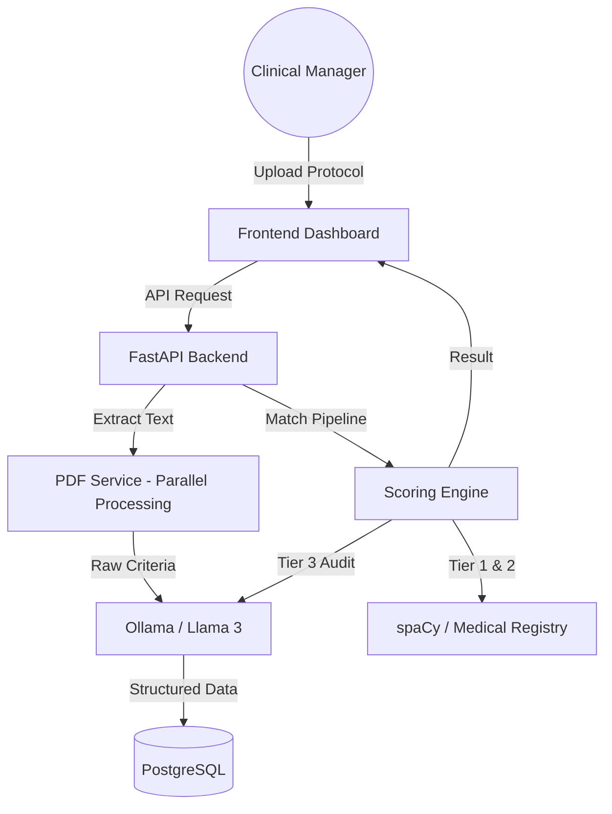

# MediTrial AI: Rule-Based Decision Support System for Clinical Trial Eligibility

MediTrial AI is a state-of-the-art clinical trial matching platform designed to bridge the gap between complex trial protocols and patient eligibility. It leverages a multi-tiered matching engine—combining hard rule-based constraints, high-speed semantic matching, and deep LLM clinical reasoning—to identify the best candidates for clinical trials with precision and speed.

## 🚀 Key Features

- **Automated Protocol Extraction**: Upload PDF trial protocols and extract inclusion/exclusion criteria, core medical conditions, and drug data in under 40 seconds using an optimized Llama 3 parser.
- **3-Tier Matching Engine**:
    - **Tier 1 (Hard Constraints)**: Instant filtering based on age, gender, and deceased status.
    - **Tier 2 (Semantic Matching)**: High-speed keyword and medical entity overlap analysis using spaCy and a custom medical registry.
    - **Tier 3 (AI Auditor)**: Deep clinical reasoning powered by Llama 3 to verify complex matches with a confidence score and narrative reasoning.
- **Large-Scale Patient Processing**: Capable of scanning thousands of patient records (2,200+ in ~30s) with intelligent caching for instant sub-second re-runs.
- **Data Governance**: Robust ETL pipeline for loading and cleaning anonymized patient data from clinical datasets.
- **Modern Dashboard**: A premium, responsive interface for trial managers to visualize matching cohorts and manage protocol lifecycles.

## 🛠 Technology Stack

- **Backend**: Python 3.12, FastAPI, SQLAlchemy
- **AI/NLP**: Ollama (Llama 3), spaCy (en_core_web_md)
- **Database**: PostgreSQL 15, PGVector (ready for RAG)
- **Frontend**: Vanilla JavaScript, CSS3 (Modern Glassmorphism Design)
- **Infrastructure**: Docker, Docker Compose

## 🏗 System Architecture



## 🚥 Getting Started

### Prerequisites
- Docker & Docker Compose
- [Ollama](https://ollama.ai/) installed on host (or via container)

### Installation

1. **Clone the Repository**
   ```bash
   git clone https://github.com/your-repo/meditrial-ai.git
   cd meditrial-ai
   ```

2. **Environment Setup**
   Create a `.env` file in the root with:
   ```env
   POSTGRES_USER=medical_ai
   POSTGRES_PASSWORD=production_password
   POSTGRES_DB=clinical_trials
   OLLAMA_BASE_URL=http://meditrial_ollama:11434
   ```

3. **Launch Infrastructure**
   ```bash
   docker compose up --build
   ```

4. **Access the App**
   - Frontend: `http://localhost:3000`
   - API Docs: `http://localhost:3000/docs`

## 📊 Performance Benchmarks
*Tested on standard CPU infrastructure*
- **PDF Extraction**: ~34s (Optimized from 2.7m)
- **Matching (2,234 patients)**: ~30s (First Run), <0.1s (Cached)
- **Medical Registry**: Supports 500+ common clinical abbreviations and entities.

## 📂 Project Structure
- `/backend`: FastAPI microservice and clinical logic.
- `/frontend`: Responsive UI and pipeline visualization.
- `/project_debug_scripts`: Internal tools for benchmarking and data verification.
- `/data`: Sample patient and trial datasets.

---
*Developed for Rule-Based clinical decision support and AI-driven healthcare optimization.*
