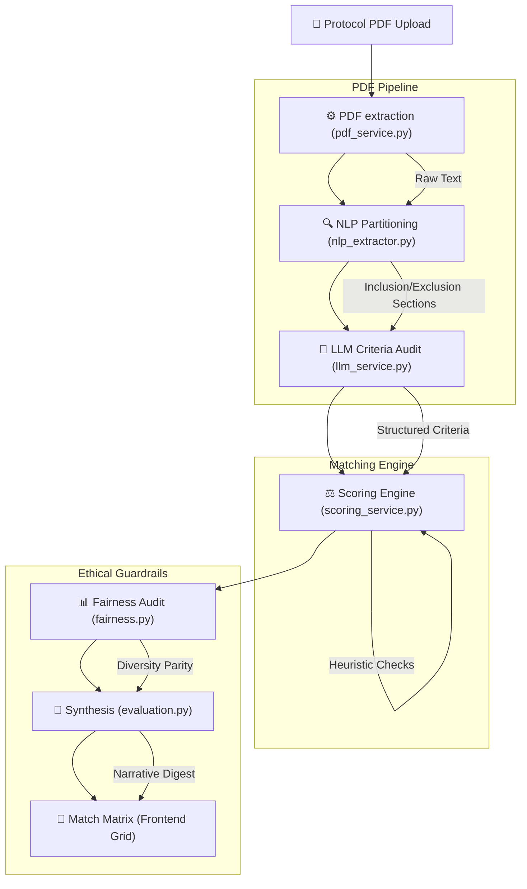

# MediTrial AI - Clinical Matching Pipeline Flow

This document details the end-to-end intelligence pipeline that transforms a clinical protocol (PDF) into validated patient matches.

## 🔄 End-to-End Intelligence Flow

## 🛠️ Module Breakdown

### 1. Extraction Pipeline (`pdf_service` & `nlp_extractor`)
- **PDF Service**: Uses `PyMuPDF` or `pdfplumber` to extract high-fidelity text.
- **NLP Extractor**: Our proprietary "Section Isolator". Uses SpaCy and Regex to separate inclusion/exclusion criteria while filtering out irrelevant sections (e.g., table of contents, contact info).

### 2. Clinical Intelligence (`llm_service`)
- **LLM Audit**: The raw criteria are sent to a locally-hosted LLM (Ollama/Llama3).
- **Audit Logic**: The LLM "cleans" medical jargon, expands abbreviations, and structures the criteria into a machine-readable format while retaining clinical intent.

### 3. Alignment Engine (`scoring_service`)
The core "Heart" of the system.
- **Vector Synthesis**: Converts patient medical history and trial criteria into embeddings.
- **Heuristic Overlays**: Applies strict "hard-stop" rules (e.g., age ranges, pregnancy status, HIV status) atop the soft vector scores.
- **Normalization**: Ensures scores are consistent (0-100%) across varying cohorts.

### 4. Ethical Shield (`fairness` & `evaluation`)
- **Fairness Service**: Calculates parity scores across Gender and Age to ensure matching isn't skewed.
- **Evaluation**: Synthesizes the top results into a human-readable clinical narrative for the final report.

---

**Flow Status: OPTIMIZED ✅**
